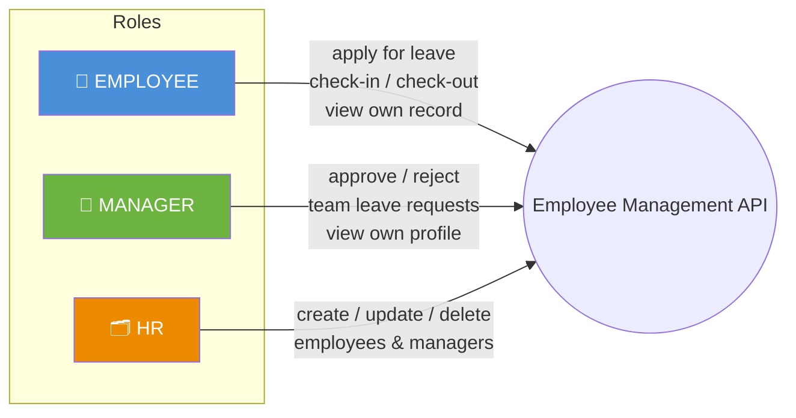
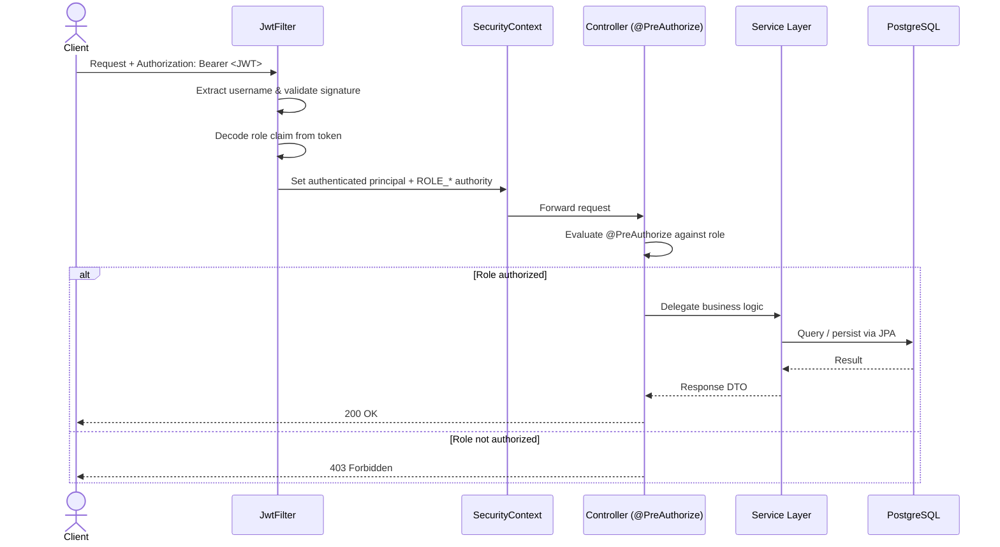
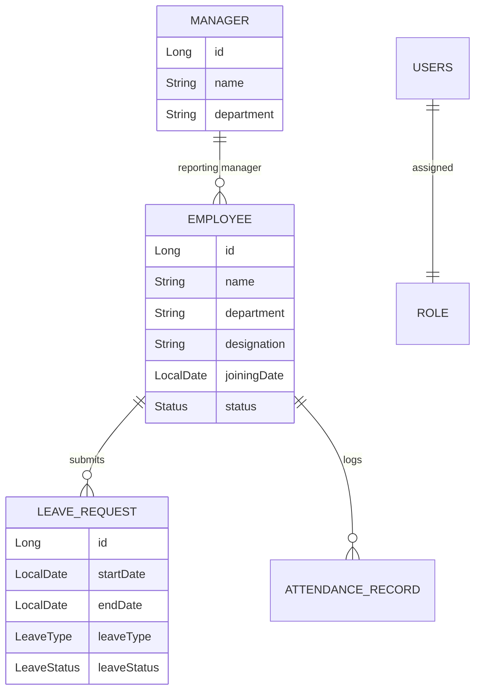

<div align="center">

# 🧑‍💼 Employee Management API
### Role-Based HR Backend — Employees, Managers & HR on One Secure Spring Boot Service

*Three roles. One token. Zero ambiguity about who can do what.*

[](https://openjdk.org/)
[](https://spring.io/projects/spring-boot)
[](https://spring.io/projects/spring-security)
[](https://www.postgresql.org/)
[](https://github.com/jwtk/jjwt)

[Why](#-why-this-exists) •
[Role Model](#-the-role-model) •
[Architecture](#-request-lifecycle) •
[Endpoints](#-api-reference) •
[Run Locally](#-getting-started)

</div>

---

## 🧭 Why This Exists

Almost every "Employee Management" tutorial project on GitHub does the same thing: one `Employee` entity, five CRUD endpoints, no auth. That's a database frontend, not a backend system.

This project asks the question a real HR platform actually has to answer: **who is allowed to do what to whom?**

An employee can apply for their own leave — but not approve it. A manager can approve their team's leave — but not create new employees. Only HR can onboard, edit, or offboard people. That's not a UI-layer decision here; it's enforced **at the method level, on every controller, via Spring Security's `@PreAuthorize`**, driven entirely by the role embedded in the JWT itself.

---

## 🔐 The Role Model



| Role | Can Do | Cannot Do |
|---|---|---|
| **EMPLOYEE** | View own profile, apply for leave, view own leave history, check in / check out | Approve leave, view other employees, manage records |
| **MANAGER** | Approve or reject leave requests from their team, view own manager profile | Create/edit employees, view other managers, HR-only actions |
| **HR** | Full CRUD on employees, full CRUD on managers | Approve leave directly (that's a manager's call), employee self-actions |

Every one of these boundaries is enforced with `@PreAuthorize("hasRole('...')")` at the controller method — not left to the frontend to "hide a button."

---

## ⚙️ Request Lifecycle



**Security is stateless end-to-end** — `SessionCreationPolicy.STATELESS` means no server-side session state; every request re-authenticates purely off the JWT, exactly the pattern real production APIs use behind a load balancer.

---

## 🛠️ Tech Stack

<table>
<tr>
<td valign="top" width="33%">

**Core**
- Java 17
- Spring Boot 3.5.4
- Maven

</td>
<td valign="top" width="33%">

**Security**
- Spring Security 6
- JJWT 0.11.5
- BCrypt (strength 12)
- Method-level `@PreAuthorize`

</td>
<td valign="top" width="33%">

**Data & Integrations**
- Spring Data JPA
- PostgreSQL
- Spring Mail (leave-decision notifications)
- Lombok

</td>
</tr>
</table>

---

## 📡 API Reference

### Auth — `/api/auth` *(public)*
| Method | Endpoint | Description |
|---|---|---|
| `POST` | `/register` | Register a new user with a role |
| `POST` | `/login` | Authenticate, receive a JWT |

### Employees — `/Employee` *(authenticated)*
| Method | Endpoint | Role Required | Description |
|---|---|---|---|
| `GET` | `/{id}` | `EMPLOYEE` | View own profile |
| `GET` | `/` | `HR`, `MANAGER` | List all employees |
| `POST` | `/` | `HR` | Onboard a new employee |
| `PUT` | `/{id}` | `HR` | Update employee details |
| `DELETE` | `/{id}` | `HR` | Offboard an employee |

### Managers — `/Manager` *(authenticated)*
| Method | Endpoint | Role Required | Description |
|---|---|---|---|
| `GET` | `/` | `HR` | List all managers |
| `GET` | `/{id}` | `MANAGER` | View own profile |
| `POST` | `/` | `HR` | Create a manager |
| `PUT` | `/{id}` | `HR` | Update a manager |
| `DELETE` | `/{id}` | `HR` | Remove a manager |

### Leave — `/leave` *(authenticated)*
| Method | Endpoint | Role Required | Description |
|---|---|---|---|
| `POST` | `/apply` | `EMPLOYEE` | Submit a leave request |
| `GET` | `/employee/{employeeId}` | `EMPLOYEE` | View own leave history |
| `PUT` | `/{id}/approve` | `MANAGER` | Approve a leave request |
| `PUT` | `/{id}/reject` | `MANAGER` | Reject a leave request |

### Attendance — `/Attendence` *(authenticated)*
| Method | Endpoint | Role Required | Description |
|---|---|---|---|
| `POST` | `/check-In/{employeeId}` | `EMPLOYEE` | Log check-in time |
| `POST` | `/check-Out/{employeeId}` | `EMPLOYEE` | Log check-out time |

> 📧 Leave approvals and rejections trigger an email notification via Spring Mail — the employee finds out the moment a manager acts, not by refreshing a dashboard.

---

## 🧩 Data Model



---

## 🚀 Getting Started

### Prerequisites
`Java 17` · `Maven` · `PostgreSQL` · `Git`

```bash
# 1. Clone
git clone https://github.com/Ashu-del/Employee-Management-API.git
cd Employee-Management-API

# 2. Create a PostgreSQL database, then configure src/main/resources/application.properties:
#    spring.datasource.url=jdbc:postgresql://localhost:5432/<your_db>
#    spring.datasource.username=<your_user>
#    spring.datasource.password=<your_password>
#    Also configure your JWT secret and mail sender credentials.

# 3. Run
./mvnw spring-boot:run
```

### Try it out
```http
### Register
POST /api/auth/register
Content-Type: application/json

{ "username": "priya.hr", "password": "••••••", "role": "HR" }

### Login → get JWT
POST /api/auth/login

### Use the token on any protected route
GET /Employee
Authorization: Bearer <JWT>
```

---

## 📂 Project Structure

```
src/main/java/com/example/employeemanagment/
├── config/          # SecurityConfig, JwtFilter — the RBAC enforcement layer
├── controllers/      # REST endpoints, one per domain (Employee, Manager, Leave, Attendance, Auth)
├── model/            # JPA entities, enums (Role, Status, LeaveType), DTOs
├── repo/              # Spring Data JPA repositories
└── service/           # Business logic — JWT issuance, leave workflow, email notifications
```

---

## 🗺️ Roadmap

- [ ] Swagger / OpenAPI docs
- [ ] Refresh token flow
- [ ] Pagination on list endpoints
- [ ] Dockerfile + Docker Compose for one-command spin-up
- [ ] Integration tests for the RBAC boundaries themselves

---

## 👤 Author

**Ashutosh Pandey**
Backend Developer · Java · Spring Boot · Spring Security

[](https://github.com/Ashu-del)

</div>
